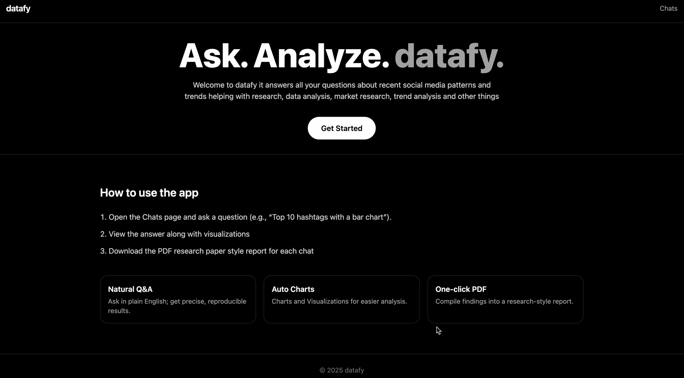
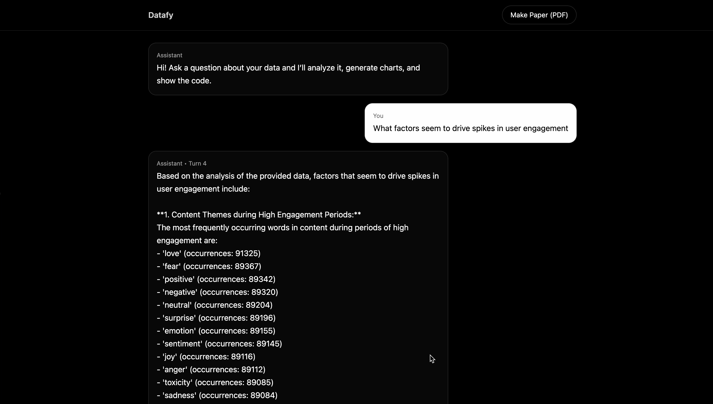
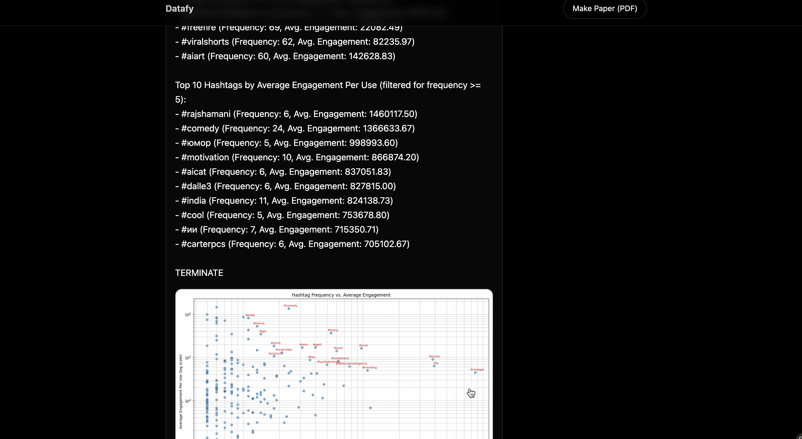
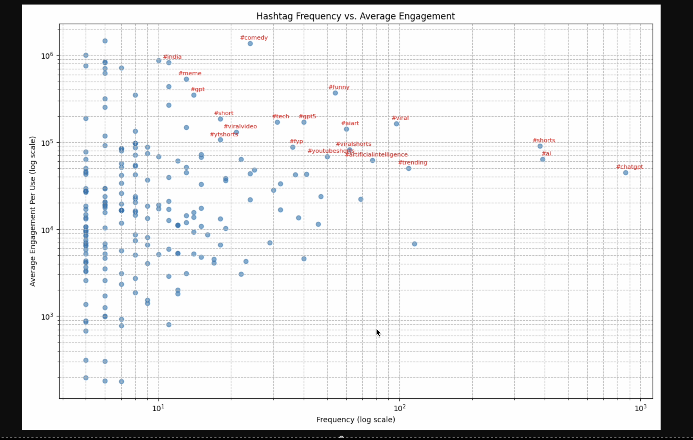

# simPPL-assignment
# Datafy  

Welcome to **Datafy** — it answers all your questions about recent social media patterns and trends, helping with data analysis, market research, trend analysis, research, and more.  

---

## Code Architecture  

- **Frontend**: Built on React.js — a clean, modern chat-like interface that makes it easy and convenient for all kinds of users.  
- **Backend**: Python backend connected with a Flask API to the frontend.  

---

## Model Architecture  
  
The agent workflow is built on **Autogen** instead of LangChain or LangGraph for more seamless chat-like interaction between agents.  

- This allows agents to iterate over the same piece of code in case of error or improper output.  
- Agents can chat among themselves to determine output quality and correctness, suggest changes, or decide to stop.  

---

## The Agents  

### Data Agent  
- Generates code to answer user queries.  
- Creates graphs to generate visualizations based on data.  
- Uses web fallback when the data cannot answer the user’s question.  
- Checks for output quality and execution errors.  
- If the output is insufficient (e.g., no results, incomplete coverage, or execution error), it generates new code.  
- Responds with **OUTPUT OK** when satisfied — this is the termination condition for the User Agent.  

### User Agent  
- Initiates chat with the query submitted by the user (via Flask API endpoint).  
- Executes the code generated by the Data Agent and responds with either error or output.  
- Stops when:  
  - The Data Agent sends **OUTPUT OK**, or  
  - A maximum number of turns is reached (to avoid infinite/very long chat cycles).  

---

## Paper Generation  

- The chat and session history are saved (query, answer, plot if any, and the code used).  
- These are compiled into a **research-paper-like report** and exported as a PDF for easy reading and sharing.  

---

## Demo  

Here are some example screenshots:  

-clean user interface
 

-answers user queries by gnerating insights and trends
  

- generates visualizations about user queries

   
